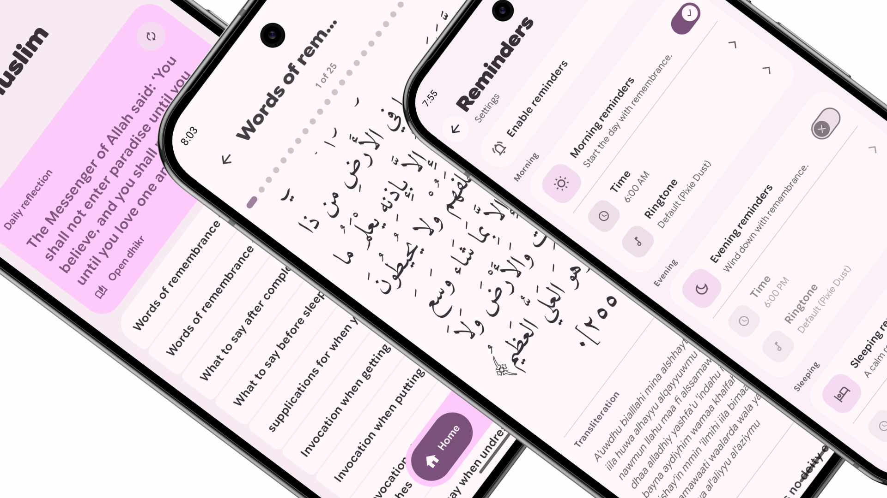
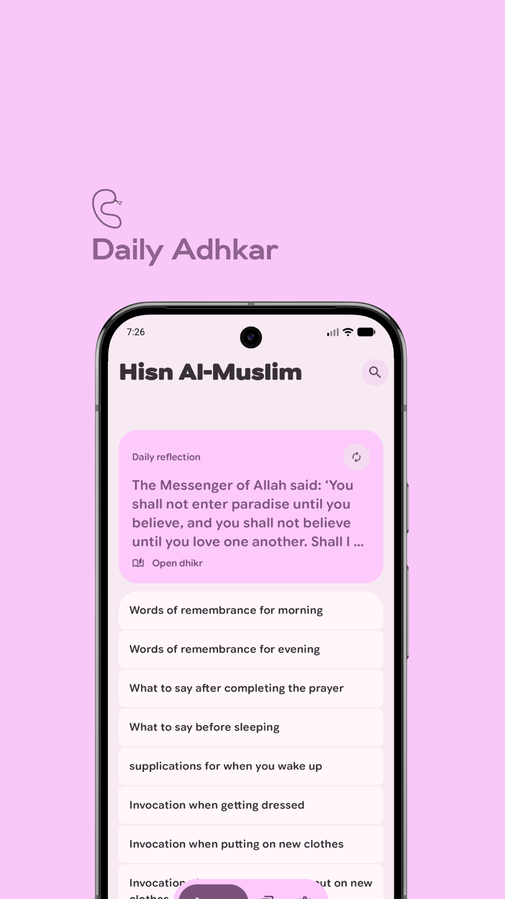
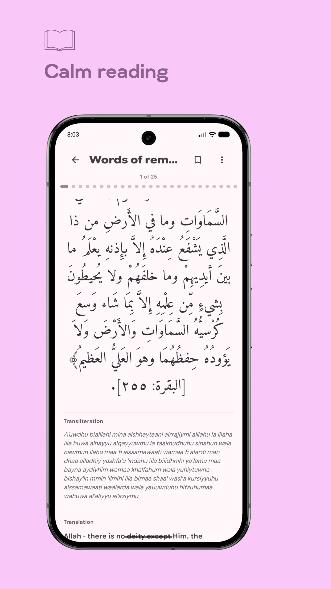
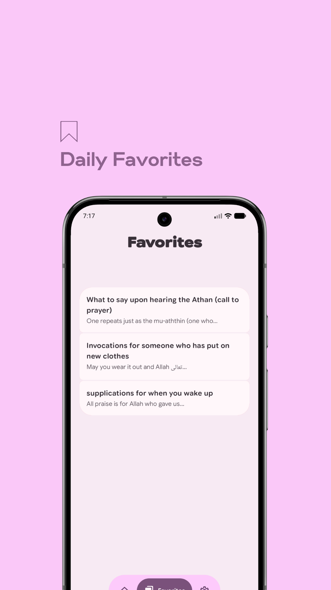
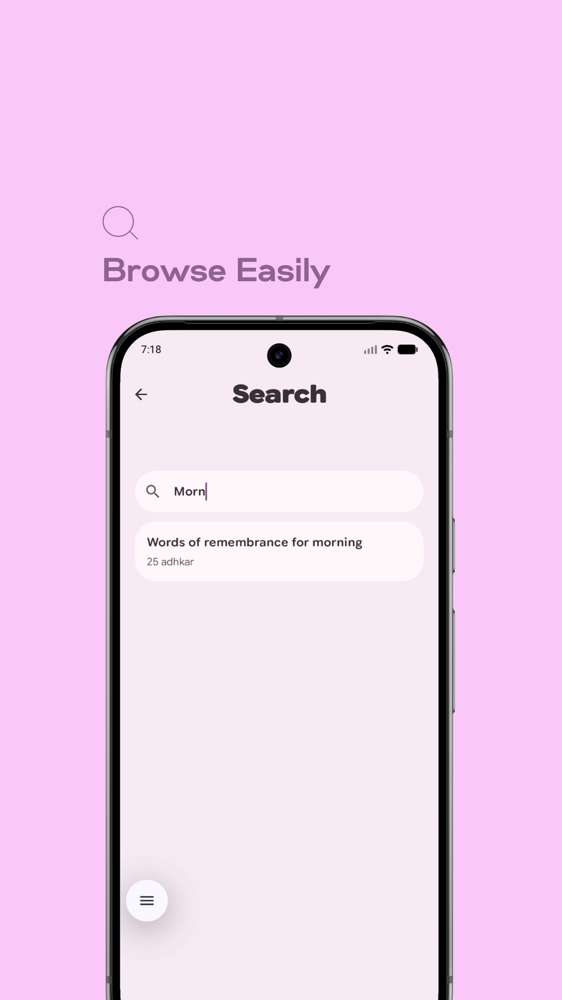
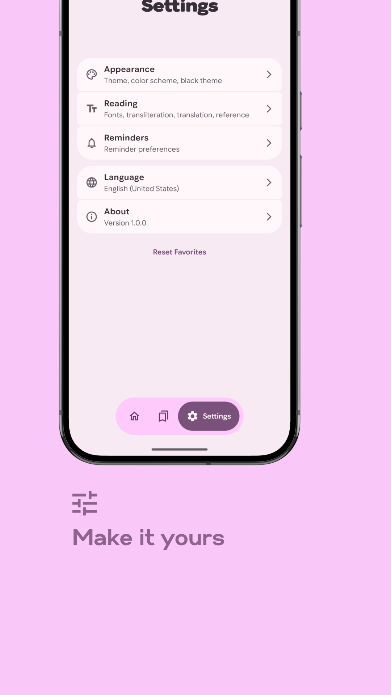
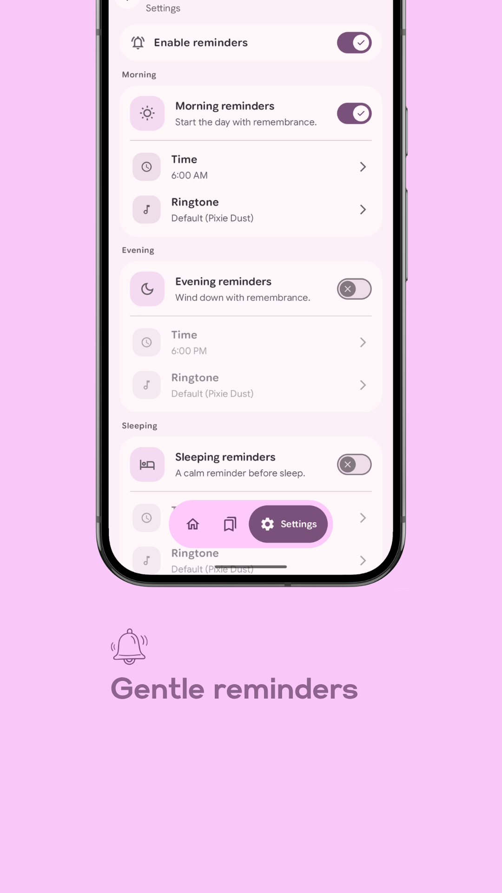

  

   
   

# Hisn Al-Muslim

## About

Hisn Al-Muslim is a calm Android app for reading, revisiting, and keeping close the daily adhkar from _Hisnul Muslim_.

## Screenshots

  
  
  
  
  
  

## Features

- Collection-based home screen for adhkar browsing
- Swipeable dhikr reader inside each collection
- Arabic font selection and reading controls
- Transliteration, translation, and reference toggles
- Favorites and collection-only search
- Morning, evening, sleeping, and repeatable reminders
- Dynamic color, black theme, and appearance settings
- Offline bundled dataset with no runtime API dependency

## Download

- **GitHub Releases**: Download the latest signed APK or app bundle from the [Releases](https://github.com/itsyaasir/hisn-al-muslim/releases/latest) page.

## License

This project is licensed under the GNU General Public License v3.0 or later.
